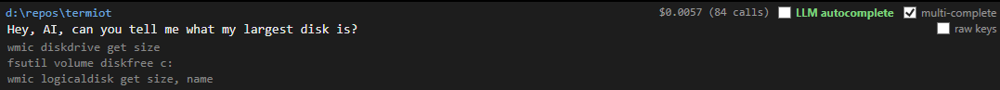
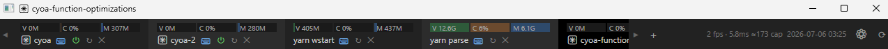

# Termiot

**Download:** https://github.com/sliftist/termiot/releases/latest

A durable terminal for windows. Remembers your tab state during reboot. Isolates every single internal shell and window in it's own process.

Uses WPF. Reasonable fast and lightweight.

MIT licensed. Fork it and fix it yourself. Stop wasting your time with terminals that refuse to add basic features and make your own.

Bug reports are welcome, feature requests are welcome. Pull requests are unlikely to be merged. This is a personal project to make a terminal that only supports features I want. If you want a feature, clone it and tell Claude to add the feature. There's 90% chance it will be able to 1 shot it.

## Features

- Basic tab support, search, ctrl+clickable links, shift+enter support in raw mode (for claude linebreaks).
- ctrl+t opens a tab in the same folder as your current folder.
    - WindowTerminal refuses to support this for cmd.exe: https://github.com/microsoft/terminal/issues/3158
- Persists tab states on disk correctly.
    - You can restore all of the windows and all the tabs on startup if you want, or you can go in and manually tell it to reopen specific windows with all their tabs magically reappearing. 
    - Everything is on disk, so you can see the state. You can change the state of (some) things, etc.
- yarn autocomplete support
    - Stop having to manually type in commands that could be auto-completed. Just fork this repo and tell Claude to add whatever autocomplete support you want. There's no need to spend years and create an entire framework for it. You can have it do exactly what you want it to do today. 
- Instead of making everything use the same process so everything crashes at once, we use different processes.
    - 30MB overhead per shell, ~100MB overhead per window. 
    - As long as you're not running on a toaster and having at least one gigabyte of memory, you're going to be able to run a lot of Windows and even more tabs.
- CPU rendering
    - Avoid weekly GPU crashes, closing all your terminal windows.
    - Frees up GPU memory, so you can run your expensive AI models. Or video games. Or screensaver. Not everyone can afford a 5090...
- VS Code/Cursor extension faster opening support.
    - Makes opening console windows for your current workspace very easy. 
- Optional LLM autocomplete support

- Programmatic changing of resume command.
    - Optional claude hook so that all of your claude windows will resume with the session that you were last running. 
- Optional resource usage support
    - You might be surprised what you find...

## Installing

Download the latest release and run it: https://github.com/sliftist/termiot/releases/latest

## Development

1. Install the .NET 10 SDK: https://dotnet.microsoft.com/download
2. Install Node.js: https://nodejs.org/
3. Install Yarn (https://yarnpkg.com/): `npm install -g yarn`
4. `git clone https://github.com/sliftist/termiot.git`
5. `cd termiot`
6. `yarn start-instance`
